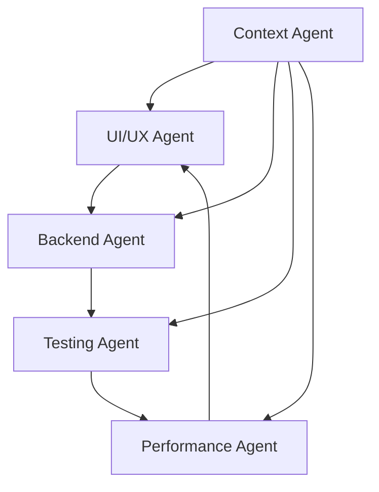

# Phoenix Precision Agency - Agent Coordination History

## Agent Work Log

### Phase 1: Initial Setup (Week 1)
**Agents Used:** Setup Agent, UI/UX Agent
- Created Next.js project with TypeScript
- Established Tailwind CSS design system
- Set up project structure with route groups
- Created initial component library

### Phase 2: Core Features (Week 2)
**Agents Used:** UI/UX Agent, Backend Agent
- Built interactive demo (2005 vs modern comparison)
- Implemented contact form with validation
- Added Redis integration for lead storage
- Set up email notifications with Resend

### Phase 3: Trust & Polish (Week 3)
**Agents Used:** UI/UX Agent, Performance Agent
- Added NASA engineer badge and credentials
- Created performance metrics section
- Implemented smooth animations
- Optimized loading performance

### Phase 4: Testing Infrastructure (Week 4)
**Agents Used:** Testing Agent, DevOps Agent
- Set up Playwright E2E tests
- Created GitHub Actions workflow
- Added multi-browser test matrix
- Implemented mobile device testing

### Phase 5: Dark Mode (Current)
**Agents Used:** UI/UX Agent, Backend Agent
- Integrated next-themes for theme management
- Created theme toggle component
- Added theme persistence API
- Updated all components for dark mode

## Successful Agent Combinations

### 1. UI + Backend Partnership
**What Worked Well:**
- Form implementation with real-time validation
- API integration with proper error handling
- Seamless data flow from frontend to backend

**Example:** Contact form with Redis storage and email notifications

### 2. Testing + Performance Duo
**What Worked Well:**
- Performance benchmarks in E2E tests
- Lighthouse score monitoring
- Bundle size tracking

**Example:** Automated performance regression tests

### 3. Context + All Agents
**What Worked Well:**
- Knowledge transfer between sessions
- Consistent coding patterns
- Reduced duplicate work

**Example:** This documentation maintaining project state

## Agent-Specific Learnings

### UI/UX Agent
- Established consistent Tailwind patterns
- Created reusable component library
- Implemented responsive design system
- Added smooth Framer Motion animations

### Backend Agent
- Set up efficient Redis data structures
- Implemented proper rate limiting
- Created type-safe API routes
- Added error handling patterns

### Testing Agent
- Configured comprehensive E2E suite
- Set up CI/CD pipeline
- Created testing best practices
- Identified mobile testing requirements

### Performance Agent
- Optimized bundle sizes
- Implemented lazy loading
- Added performance monitoring
- Created optimization checklist

### Context Management Agent
- Maintained project documentation
- Created quick reference guides
- Tracked technical decisions
- Facilitated knowledge transfer

## Cross-Agent Dependencies

## Lessons Learned

### Do's
1. **Always Read First**: Use Read tool before editing
2. **Test Locally**: Run tests before pushing
3. **Document Decisions**: Update context files
4. **Use Established Patterns**: Follow existing conventions
5. **Communicate State**: Leave clear TODOs

### Don'ts
1. **Don't Create Unnecessary Files**: Edit existing when possible
2. **Don't Skip Tests**: Always verify changes
3. **Don't Ignore Context**: Read PROJECT_CONTEXT.md
4. **Don't Break Conventions**: Maintain consistency
5. **Don't Work in Isolation**: Consider other agents' work

## Handoff Protocol

When switching between agents:

1. **Update Context Files**
   - PROJECT_CONTEXT.md for major changes
   - AGENT_QUICK_CONTEXT.md for current state
   - Specific context files for domain areas

2. **Leave Clear TODOs**
   - Use TodoWrite tool for task tracking
   - Mark in_progress and completed items
   - Add new tasks discovered

3. **Document Blockers**
   - What prevented completion
   - What's needed to proceed
   - Who should handle it

4. **Test Status**
   - What tests are passing/failing
   - Why tests might be failing
   - Next steps for fixes

## Current Agent Needs

### For UI/UX Agent
- Fix duplicate elements (test IDs needed)
- Add missing content sections
- Verify dark mode contrast ratios
- Fix mobile touch targets

### For Testing Agent
- Update E2E tests for new content
- Fix failing test selectors
- Add dark mode tests
- Verify mobile viewport tests

### For Backend Agent
- Monitor Redis performance
- Check rate limiting effectiveness
- Verify email delivery rates
- Optimize API response times

### For Performance Agent
- Analyze bundle size growth
- Check Core Web Vitals
- Optimize image loading
- Review third-party scripts

---
**Last Updated:** 2025-08-03
**Total Agents Used:** 6
**Success Rate:** High - MVP successfully deployed