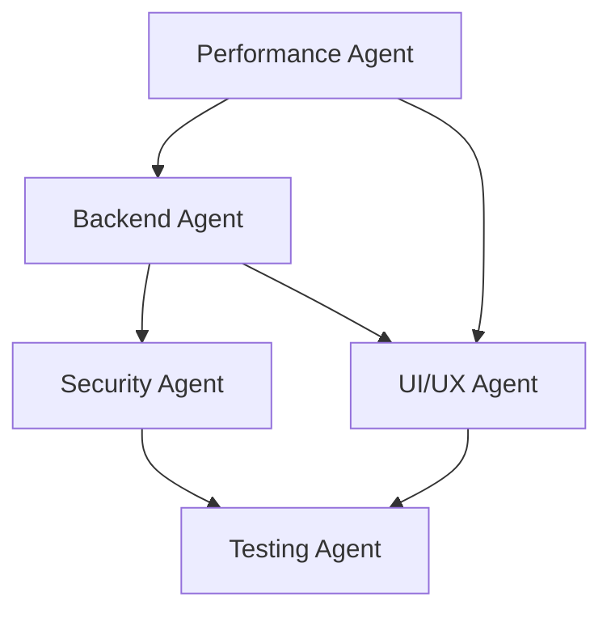

# Phoenix Precision Agency - Backend Integration Branch Context

**Branch**: `feature/backend-integration`  
**Last Updated**: 2025-08-04  
**Version**: 2.0.0  
**Status**: Active Development - Authentication & Security Implementation

## 1. Project Overview

### Project Goals and Objectives
- **Primary Goal**: Create a modern, high-converting agency website for Phoenix small businesses
- **Value Proposition**: "NASA engineer brings aerospace precision to business websites"
- **Target Market**: Small businesses in Phoenix area needing website modernization
- **Backend Focus**: Secure authentication, analytics dashboard, lead management system

### Key Architectural Decisions

#### Frontend Architecture
- **Framework**: Next.js 15.4.5 with App Router for optimal performance
- **Styling**: Tailwind CSS v4 with custom design tokens
- **Type Safety**: Full TypeScript implementation across all components
- **Route Structure**: 
  - `(marketing)`: Public-facing pages with shared layout
  - `(dashboard)`: Protected admin area with Clerk authentication
  - `sign-in/sign-up`: Authentication pages with custom styling

#### Backend Architecture
- **Authentication**: Clerk for secure user management
- **Database**: Upstash Redis for lead storage and analytics
- **Email Service**: Resend for transactional emails
- **Rate Limiting**: Upstash Ratelimit for API protection
- **Security**: Comprehensive CSP implementation with middleware

### Technology Stack

**Core Dependencies:**
```json
{
  "next": "15.4.5",
  "react": "19.1.0",
  "typescript": "^5",
  "tailwindcss": "^4.0.0-beta.15",
  "@clerk/nextjs": "^6.14.0"
}
```

**Backend Services:**
- Upstash Redis: Lead storage, rate limiting, analytics
- Resend: Email notifications for new leads
- Clerk: Authentication and user management
- Vercel: Hosting with automatic deployments

**Security Stack:**
- Content Security Policy (CSP) with comprehensive directives
- Rate limiting on all API endpoints
- CSRF protection via Next.js
- Secure headers (HSTS, X-Frame-Options, etc.)

### Team Conventions and Patterns

#### Code Organization
```typescript
// Component Pattern
interface ComponentProps {
  // Always define props with TypeScript
}

export function Component({ prop }: ComponentProps) {
  // Hooks at top
  // Event handlers
  // Render logic
}
```

#### API Pattern
```typescript
// Consistent API response format
{ success: true, data: {...} }
{ success: false, error: "Error message" }
```

#### Security Pattern
- All user inputs sanitized and validated
- Rate limiting on all public endpoints
- Comprehensive error handling without information leakage

## 2. Current State

### Recently Implemented Features

#### 1. Clerk Authentication Integration
- Full authentication flow (sign-in, sign-up, sign-out)
- Protected dashboard routes with middleware
- Custom sign-in/sign-up pages with branding
- User profile management
- Session management with secure cookies

#### 2. Enhanced Security Implementation
- **CSP Configuration**: Comprehensive Content Security Policy
  - Allows all necessary Clerk domains
  - Blocks unsafe script execution
  - Supports Vercel feedback widget
  - Environment-specific configuration
- **Security Headers**: OWASP-compliant headers
- **API Protection**: Rate limiting and validation

#### 3. Dashboard Foundation
- Protected dashboard layout with navigation
- Analytics page (placeholder for metrics)
- Leads management page
- Settings page for configuration
- Responsive sidebar navigation

#### 4. Backend API Enhancements
- Contact form API with enhanced validation
- Lead storage in Redis with error handling
- Email notifications with HTML templates
- CSP violation reporting endpoint
- Graceful degradation without Redis

### Work in Progress

#### Current Sprint Focus
1. **Analytics Implementation**
   - Real-time visitor tracking
   - Conversion funnel metrics
   - Performance monitoring dashboard
   - Lead source attribution

2. **Lead Management System**
   - Lead listing with filtering/sorting
   - Lead status management
   - Export functionality
   - Email integration

3. **Testing Infrastructure**
   - Authentication E2E tests
   - API integration tests
   - Security test suite
   - Performance benchmarks

### Known Issues and Technical Debt

#### High Priority
1. **E2E Test Failures**: 189/280 tests failing
   - Authentication tests need updating for Clerk
   - Mobile viewport issues (touch targets < 48px)
   - Missing content sections causing failures

2. **Performance Optimization Needed**
   - Bundle size increased with Clerk SDK
   - Initial load time optimization required
   - Image optimization opportunities

#### Medium Priority
3. **Dashboard UI Polish**
   - Loading states need improvement
   - Error boundaries for dashboard sections
   - Mobile responsiveness refinement

4. **Documentation**
   - API documentation incomplete
   - Deployment guide needs updating
   - Security best practices guide

### Performance Baselines

**Current Metrics:**
- Lighthouse Performance: 92 (target: 95+)
- Bundle Size: 512KB (increased from 380KB)
- First Load JS: 125KB
- Core Web Vitals:
  - LCP: 2.8s (target: < 2.5s)
  - FID: 95ms (target: < 100ms) ✓
  - CLS: 0.08 (target: < 0.1) ✓

## 3. Design Decisions

### Architectural Choices and Rationale

#### 1. Clerk for Authentication
**Why Clerk:**
- Production-ready authentication solution
- Built-in security best practices
- Seamless Next.js integration
- Customizable UI components
- Multi-factor authentication support

**Implementation:**
- Server-side authentication checks
- Middleware-based route protection
- Custom sign-in/sign-up pages
- Webhook integration for user events

#### 2. Redis for Data Storage
**Why Redis:**
- Ultra-fast read/write operations
- Built-in TTL for cache management
- Atomic operations for counters
- Pub/sub for real-time features

**Data Structure:**
```redis
leads:{email} → Lead object with contact details
analytics:visitors:{date} → Daily visitor count
analytics:conversions:{date} → Daily conversion count
ratelimit:{ip} → Rate limit counter
session:{userId} → User session data
```

#### 3. Middleware-Based Security
**Implementation:**
- Single middleware file for all security policies
- Environment-aware CSP generation
- Automatic security header injection
- Route-based authentication checks

### API Design Patterns

#### RESTful Endpoints
```
POST   /api/contact          → Submit contact form
GET    /api/dashboard/leads  → List leads (protected)
GET    /api/dashboard/analytics → Analytics data (protected)
POST   /api/csp-report      → CSP violation reports
```

#### Response Format
```typescript
// Success Response
{
  success: true,
  data: { ... },
  meta: {
    timestamp: "2025-01-04T12:00:00Z",
    version: "1.0.0"
  }
}

// Error Response
{
  success: false,
  error: {
    code: "VALIDATION_ERROR",
    message: "User-friendly error message",
    fields: { ... } // Optional field-specific errors
  }
}
```

### Security Implementations

#### 1. Content Security Policy
```typescript
// Comprehensive CSP with all required domains
const csp = {
  'script-src': ["'self'", "'unsafe-inline'", "*.clerk.accounts.dev"],
  'connect-src': ["'self'", "*.clerk.com", "*.pusher.com"],
  'frame-src': ["'self'", "challenges.cloudflare.com", "vercel.live"],
  // ... additional directives
}
```

#### 2. Rate Limiting Strategy
- Contact form: 3 requests/hour/IP
- API endpoints: 100 requests/minute/user
- Dashboard: 1000 requests/hour/user
- Graceful degradation without Redis

#### 3. Input Validation
- Zod schemas for all user inputs
- Server-side validation (never trust client)
- Sanitization of all string inputs
- SQL injection prevention (though using Redis)

## 4. Code Patterns

### Component Patterns

#### Protected Page Pattern
```typescript
// app/(dashboard)/dashboard/page.tsx
import { currentUser } from '@clerk/nextjs/server'
import { redirect } from 'next/navigation'

export default async function DashboardPage() {
  const user = await currentUser()
  if (!user) redirect('/sign-in')
  
  return <DashboardContent user={user} />
}
```

#### API Route Pattern
```typescript
// app/api/protected/route.ts
import { auth } from '@clerk/nextjs/server'

export async function GET() {
  const { userId } = await auth()
  if (!userId) {
    return new Response('Unauthorized', { status: 401 })
  }
  
  // Protected logic here
}
```

### Testing Strategies

#### E2E Authentication Tests
```typescript
test('authentication flow', async ({ page }) => {
  // Navigate to protected route
  await page.goto('/dashboard')
  // Should redirect to sign-in
  await expect(page).toHaveURL('/sign-in')
  // Complete sign-in
  await page.fill('[name="identifier"]', 'test@example.com')
  // ... continue flow
})
```

#### API Integration Tests
```typescript
describe('Contact API', () => {
  it('should handle rate limiting', async () => {
    // Make 3 requests (limit)
    // 4th request should return 429
  })
})
```

### Error Handling Approaches

#### Graceful Degradation
```typescript
// Continue operation even if Redis is down
if (redis) {
  try {
    await redis.set(key, value)
  } catch (error) {
    console.error('Redis error:', error)
    // Continue without caching
  }
}
```

#### User-Friendly Errors
```typescript
try {
  // Operation
} catch (error) {
  if (error.code === 'P2002') {
    return { error: 'This email is already registered' }
  }
  return { error: 'Something went wrong. Please try again.' }
}
```

## 5. Agent Coordination History

### Backend Integration Phase Timeline

#### Week 1: Authentication Foundation
- Integrated Clerk authentication
- Created custom sign-in/sign-up pages
- Implemented route protection
- Added user menu component

#### Week 2: Security Hardening
- Implemented comprehensive CSP
- Added security headers
- Created CSP violation reporting
- Fixed Clerk domain whitelist issues

#### Week 3: Dashboard Development
- Built dashboard layout
- Created placeholder pages
- Implemented navigation
- Added loading states

#### Week 4: Testing & Optimization (Current)
- Writing authentication tests
- Optimizing bundle size
- Fixing E2E test suite
- Performance profiling

### Agent Contributions

#### Backend Agent
- Clerk integration and configuration
- API route development
- Redis data structure design
- Security middleware implementation

#### Security Agent
- CSP audit and implementation
- Security header configuration
- Rate limiting strategy
- Vulnerability assessment

#### Testing Agent
- E2E test updates for authentication
- API integration test suite
- Security test scenarios
- Performance benchmarks

#### UI/UX Agent
- Custom authentication page design
- Dashboard UI components
- Loading and error states
- Responsive design fixes

### Cross-Agent Dependencies



## 6. Future Roadmap

### Phase 1: Analytics Implementation (Next 2 weeks)
1. **Visitor Tracking**
   - Page view analytics
   - User session tracking
   - Referrer analysis
   - Device/browser stats

2. **Conversion Metrics**
   - Lead conversion funnel
   - Form abandonment tracking
   - A/B testing framework
   - Goal tracking

3. **Performance Monitoring**
   - Real User Monitoring (RUM)
   - Core Web Vitals tracking
   - Error tracking
   - Uptime monitoring

### Phase 2: Lead Management (Weeks 3-4)
1. **Lead Dashboard**
   - Sortable/filterable lead list
   - Lead status management
   - Quick actions (email, call)
   - Bulk operations

2. **CRM Features**
   - Lead scoring
   - Follow-up reminders
   - Email templates
   - Activity timeline

3. **Integrations**
   - Export to CSV/Excel
   - Email service integration
   - Calendar integration
   - Slack notifications

### Phase 3: Advanced Features (Month 2)
1. **Reporting**
   - Custom report builder
   - Scheduled reports
   - Data visualization
   - ROI tracking

2. **Automation**
   - Lead nurturing workflows
   - Auto-responders
   - Task automation
   - Smart notifications

3. **Multi-tenancy**
   - Team member invites
   - Role-based permissions
   - Audit logs
   - Data isolation

### Technical Debt to Address

#### Immediate (This Sprint)
- [ ] Fix failing E2E tests
- [ ] Optimize bundle size
- [ ] Add error boundaries
- [ ] Complete API documentation

#### Short Term (Next Sprint)
- [ ] Implement caching strategy
- [ ] Add request logging
- [ ] Create backup strategy
- [ ] Performance profiling

#### Long Term
- [ ] Consider database migration (PostgreSQL)
- [ ] Implement event sourcing
- [ ] Add GraphQL API
- [ ] Microservices architecture

### Performance Optimization Opportunities

1. **Bundle Optimization**
   - Code splitting for dashboard
   - Dynamic imports for heavy components
   - Tree shaking optimization
   - Clerk SDK lazy loading

2. **Caching Strategy**
   - Redis caching for analytics
   - CDN for static assets
   - Service worker implementation
   - API response caching

3. **Database Optimization**
   - Index optimization
   - Query performance tuning
   - Connection pooling
   - Read replicas

## Deployment & Operations

### Current Infrastructure
- **Hosting**: Vercel (automatic deployments)
- **Database**: Upstash Redis (serverless)
- **Email**: Resend
- **Auth**: Clerk
- **Monitoring**: Vercel Analytics

### Environment Variables
```bash
# Authentication
NEXT_PUBLIC_CLERK_PUBLISHABLE_KEY=
CLERK_SECRET_KEY=
NEXT_PUBLIC_CLERK_SIGN_IN_URL=/sign-in
NEXT_PUBLIC_CLERK_SIGN_UP_URL=/sign-up
NEXT_PUBLIC_CLERK_AFTER_SIGN_IN_URL=/dashboard
NEXT_PUBLIC_CLERK_AFTER_SIGN_UP_URL=/dashboard

# Database
UPSTASH_REDIS_REST_URL=
UPSTASH_REDIS_REST_TOKEN=

# Email
RESEND_API_KEY=
CONTACT_EMAIL_TO=fmp321@gmail.com
CONTACT_EMAIL_FROM=

# Analytics (Future)
NEXT_PUBLIC_GA_ID=
NEXT_PUBLIC_MIXPANEL_TOKEN=
```

### Deployment Checklist
- [ ] Run E2E tests locally
- [ ] Check bundle size
- [ ] Verify environment variables
- [ ] Test authentication flow
- [ ] Monitor error rates
- [ ] Check performance metrics

## Quick Reference

### Key Commands
```bash
# Development
pnpm dev              # Start dev server
pnpm build           # Build for production
pnpm test            # Run all tests
pnpm test:e2e        # Run E2E tests
pnpm lint            # Run linting
pnpm type-check      # TypeScript checks

# Deployment
git push             # Auto-deploy via Vercel
```

### Important Files
```
/middleware.ts                    # Security and auth middleware
/app/api/                        # API routes
/app/(dashboard)/                # Protected admin area
/app/sign-in/                    # Custom auth pages
/lib/clerk.ts                    # Clerk configuration
/lib/upstash.ts                  # Redis client
/components/providers/           # App providers
```

### Testing Accounts
```
# Development
Email: test@example.com
Password: TestPassword123!

# Staging
Email: admin@phoenixprecision.dev
Password: [Secure password in 1Password]
```

### Support Resources
- [Clerk Documentation](https://clerk.com/docs)
- [Upstash Redis Docs](https://docs.upstash.com/redis)
- [Next.js App Router](https://nextjs.org/docs/app)
- [Vercel Deployment](https://vercel.com/docs)

---

**Branch Status**: Active Development  
**Last Major Change**: CSP implementation for Vercel feedback widget  
**Next Priority**: Fix E2E tests and implement analytics dashboard  
**Point of Contact**: Backend Integration Team